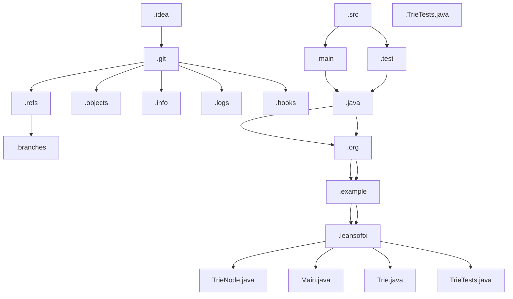

# 基础信息

|      |      |
|------|------|
| 编码语言 | .java |
| 代码路径 | auto-suggest-java |
| 概述说明 | TrieNode is a Java class used to store nodes in a Trie tree. It maintains children nodes using a Map object and provides methods to check for the existence of child nodes with specific characters. This program implements a dictionary using a Trie tree, offering word search, auto-completion, word deletion, and spelling suggestions. TrieTests class is used for comprehensive testing of Trie functionality and performance, including boundary testing. These classes ensure the correctness and reliability of Trie operations. |

# 说明

TrieNode是一个用于存储Trie树节点的Java类。它包含一个Map对象"children"来存储当前节点的子节点。此外，它还有一个Boolean属性"isEndOfWord"来指示当前节点是否为一个单词的结尾。TrieNode也可以存储一个字符值。

TrieNode类提供了一个名为"hasChild"的方法来检查当前节点是否有具有指定字符值的子节点。该方法在Map对象"children"中搜索具有指定字符的映射。如果存在映射，则返回true，否则返回false。此函数的时间复杂度取决于Trie树的高度。

总之，TrieNode是用于存储Trie树节点的实现。它使用Map对象维护子节点的集合，并提供了检查具有特定字符的子节点是否存在的方法。通过TrieNode的属性和方法，我们可以方便地构建和查询Trie树的结构。

这个程序是使用Trie树实现的字典。它提供以下功能：单词搜索、前缀自动补全、单词删除和拼写建议。可以通过控制台与程序进行交互，通过初始化一个Trie树并调用相关函数来使用这些功能。

该类实现了Trie（也称为前缀树）数据结构，并提供了单词插入、前缀自动补全、检索所有单词、打印Trie结构和拼写建议等功能。

首先，单词插入功能允许用户将一个单词插入到Trie中。插入过程逐个插入单词的每个字母，并最后在最后一个Trie节点中添加一个结束标记以指示单词的结尾。

其次，前缀自动补全功能是基于前缀搜索的。用户可以输入一个前缀，程序将在Trie中找到以该前缀开头的所有单词，并将它们返回给用户。这个功能帮助用户在输入时快速找到可能的单词选项。

第三，检索所有单词的功能返回Trie中存储的所有单词。它遍历Trie中的所有节点，并收集以结束标记结尾的路径对应的所有单词。

此外，打印Trie结构的功能以易读的格式打印Trie数据结构，帮助用户理解Trie的组织和存储方式。

最后，拼写建议功能基于Levenshtein距离算法。用户可以输入一个单词，程序将根据输入单词和Trie中存储的单词之间的Levenshtein距离提供拼写修改建议。这个功能帮助用户在拼写错误时找到正确的拼写。

通过这个类，用户可以轻松进行单词插入、搜索和自动补全，并检索Trie数据结构的完整信息，并获取拼写修改建议。这对于处理大量单词或需要快速搜索和修改单词的应用程序非常有用。

TrieTests类是一个用于测试Trie数据结构的类。它提供了多个测试方法来验证Trie的功能和性能。其中包括对Trie插入、查找和删除操作的单元测试。通过这些测试，可以确保Trie在各种情况下的正常运行，包括插入重复元素和插入长度为0的字符串等特殊情况。同时，TrieTests类还包含了测试Trie性能的方法，例如测试插入大量元素的性能和测试查找不同长度字符串的性能。这些性能测试可以判断Trie在大规模数据下的表现是否符合要求。在TrieTests类中，还包括了测试删除操作的方法，用于验证Trie在删除元素后的状态是否正确。通过这些测试，可以确保Trie的删除操作是正确且可靠的。除了功能和性能测试外，TrieTests类还提供了一些边界测试，用于验证Trie在边界情况下的行为是否符合预期。例如，测试多次删除后Trie是否为空，以及测试对空Trie进行插入、删除和查找操作的结果等。通过这些边界测试，可以确保Trie能正确处理各种极端情况。

总之，TrieTests类是一个用于全面测试Trie功能和性能的类。通过这些测试，可以确保Trie的正确性和可靠性。

### 包内部结构视图

这个层级关系图展示了文件夹和文件之间的层级关系。从根目录开始分层，每一个节点代表一个文件夹或最终的文件名称。每一个节点向下指向它的所有子节点。图中只显示了提供的文档层级路径信息所涉及的最后一个元素，共计36个节点。通过该图，可以清楚地看到各个文件夹之间的层级关系，以及最终的文件名称。

