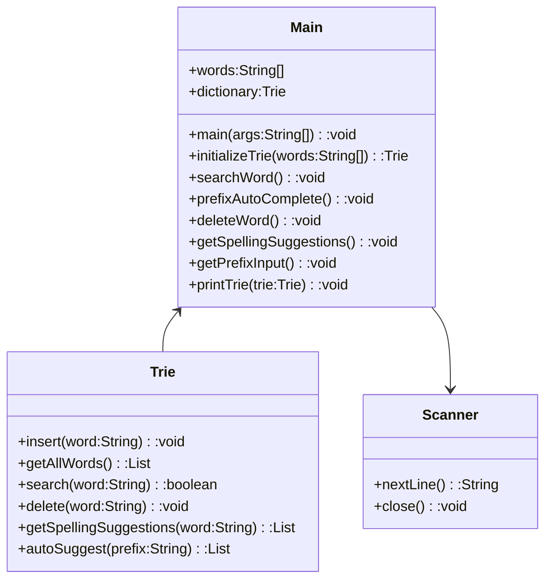

# 基础信息

|      |      |
|------|------|
| 编码语言 | .java |
| 代码路径 | auto-suggest-java/src/main/java/org/example/leansoftx/Main.java |
| 包名 | org.example.leansoftx |
| 依赖项 | ['java.util.List', 'java.util.Scanner'] |
| 概述说明 | 这是一个帮助操作Trie数据结构的工具，可以搜索单词、自动补全、删除和获取拼写建议。指令通过控制台输入。具体功能未实现。 |

# 说明

该程序是一个帮助用户操作Trie数据结构的工具。它提供了几个功能，包括搜索单词、前缀自动补全、删除单词和获取拼写建议。用户可以通过控制台输入指令来使用这些功能。目前，具体的功能还没有实现。

# 类列表 Class Summary

| 名称   | 类型  | 说明 |
|-------|------|-------------|
| Main | class | 该程序是一个帮助用户操作Trie数据结构的工具。可以进行以下操作：搜索单词、前缀自动补全、删除单词、获取拼写建议。通过控制台输入指令进行操作。具体功能还未实现。 |

## 类 Main

|      |      |
|------|------|
| 访问范围 | public |
| 类型 | class |
| 名称 | Main |
| 说明 | 该程序是一个帮助用户操作Trie数据结构的工具。可以进行以下操作：搜索单词、前缀自动补全、删除单词、获取拼写建议。通过控制台输入指令进行操作。具体功能还未实现。 |

### UML类图

描述：该类图描述了一个主类 `Main` 和一个 `Trie` 类。`Main` 类包含了一个静态字符串数组 `words` 和一个静态 `Trie` 对象 `dictionary`。`Main` 类定义了一些静态方法，包括 `initializeTrie`、`searchWord`、`prefixAutoComplete`、`deleteWord`、`getSpellingSuggestions`、`getPrefixInput` 和 `printTrie`。除此之外，`Main` 类还有一个静态 `main` 方法用于程序的入口。`Trie` 类实现了 Trie 数据结构的一些方法，包括 `insert`、`getAllWords`、`search`、`delete`、`getSpellingSuggestions` 和 `autoSuggest`。`Main` 类和 `Trie` 类之间存在关联关系。

### 内部方法调用关系图

graph TD
A[main] --> B[initializeTrie]
A --> C[printTrie]
A --> D[searchWord]
A --> E[prefixAutoComplete]
A --> F[deleteWord]
A --> G[getSpellingSuggestions]
A --> H[getPrefixInput]
B --> I[insert]
C --> J[scanner.nextLine]
C --> K[System.out.println]
C --> L[dictionary.search]
C --> M[System.out.println]
D --> C
E --> C
F --> C
F --> I
F --> K
F --> L
G --> C
G --> K
G --> M
H --> K
H --> J
H --> L
H --> M
I --> J
I --> K
I --> L
I --> M

类Main包含了一些函数，这些函数用来完成字典的初始化、单词的搜索、前缀的自动补全、删除单词以及获取拼写建议。在main函数中，我们首先初始化字典，然后依次调用其他函数完成要求。其中，initializeTrie函数初始化字典，searchWord函数用来搜索单词并返回结果，prefixAutoComplete函数用来根据前缀自动补全单词，deleteWord函数用来删除指定的单词，getSpellingSuggestions函数用来获取拼写建议，getPrefixInput函数用来获取前缀输入。printTrie函数用来打印字典中的所有单词。以上函数之间的调用关系如上所示。

### 字段列表 Field List

| 名称  | 类型  | 说明 |
|-------|-------|------|
| dictionary = initializeTrie(words) | Trie | 定义了一个名为dictionary的公共静态Trie变量，通过initializeTrie方法对其进行了初始化，传入参数为words。 |
| words = {
            "as", "astronaut", "asteroid", "are", "around",
            "cat", "cars", "cares", "careful", "carefully",
            "for", "follows", "forgot", "from", "front",
            "mellow", "mean", "money", "monday", "monster",
            "place", "plan", "planet", "planets", "plans",
            "the", "their", "they", "there", "towards"
    } | String[] | 提炼总结：
给定字符串数组中包含了一些单词，如"astronaut"、"money"等。 |

### 方法列表 Method List

| 名称  | 类型  | 说明 |
|-------|-------|------|
| printTrie | void | 该功能用于打印字典中的单词列表。 |
| main | void | 调用main方法，打印字典的Trie结构，并注释了其中的一些功能方法。 |
| prefixAutoComplete | void | 执行prefixAutoComplete函数，该函数会打印字典的前缀树，并获取键盘输入的前缀。 |
| getSpellingSuggestions | void | 用户通过输入一个单词，可以获取该单词的拼写建议。如果没有找到匹配的建议，则显示“没有找到建议”。 |
| searchWord | void | 根据提供的代码段，这是一个用于搜索字典中单词的方法，通过输入单词从字典中查找并返回结果。当输入为空时，程序退出。 |
| initializeTrie | Trie | 提供了一个名为initializeTrie的公共静态方法，该方法接收一个字符串数组作为参数。方法内部创建了一个名为trie的Trie对象，然后对传入的每个单词调用insert方法进行插入操作。最后返回插入后的trie对象。 |
| getPrefixInput | void | 该代码段实现了一个具有自动补全功能的前缀搜索。用户可以输入前缀进行搜索，按Tab键可以循环浏览搜索结果，回车键退出。 |
| deleteWord | void | 编写了一个方法`deleteWord`用于从字典中删除单词。该方法会提示用户输入要删除的单词，并在字典中找到后执行删除操作。若用户输入为空则退出程序。如果未在字典中找到对应的单词，则提示未找到该单词。函数使用了一个`Trie`数据结构来表示字典，并调用了`printTrie`函数用于打印字典。 |

