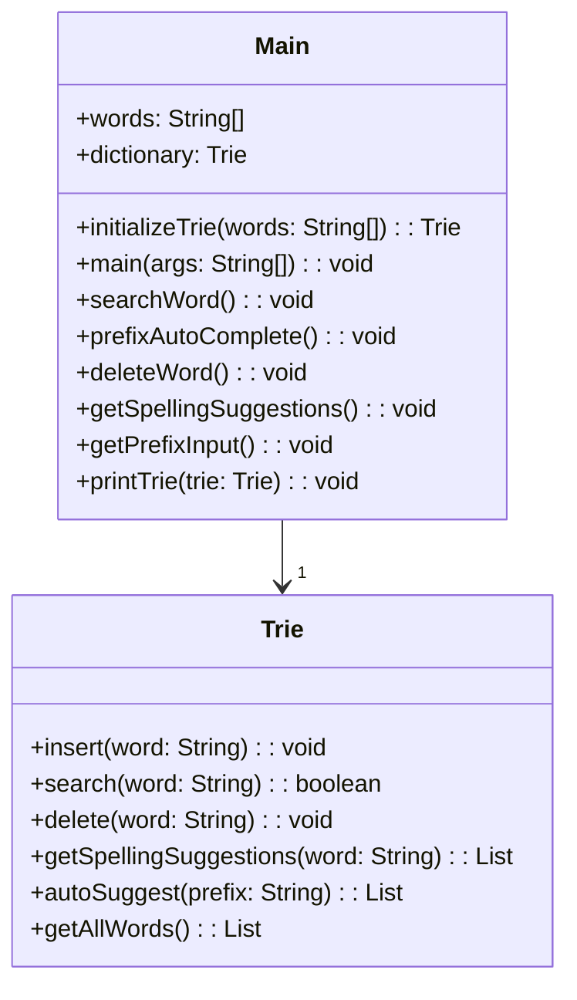

# 基础信息

|      |      |
|------|------|
| 编码语言 | .java |
| 代码路径 | auto-suggest-java/src/main/java/org/example/leansoftx/Main.java |
| 包名 | org.example.leansoftx |
| 依赖项 | ['java.util.List', 'java.util.Scanner'] |
| 概述说明 | 这个程序是一个利用前缀树（Trie）实现的字典，能够搜索、补全、删除和获取拼写建议。通过初始化Trie树并调用对应函数实现功能，并通过控制台与用户交互。 |

# 说明

这个程序是一个使用前缀树（Trie）实现的字典。它提供了以下操作：搜索单词、自动补全前缀、删除单词和获取拼写建议。程序可以通过初始化Trie树并调用相应的函数来实现这些功能。用户可以通过控制台输入与程序进行交互。

# 类列表 Class Summary

| 名称   | 类型  | 说明 |
|-------|------|-------------|
| Main | class | 这个程序是一个利用前缀树（Trie）实现的字典。可以进行以下操作：搜索一个单词、自动补全前缀、删除一个单词、获取拼写建议。通过初始化Trie树并调用对应函数来实现相应功能。程序通过控制台输入和输出来与用户交互。 |

## 类 Main

|      |      |
|------|------|
| 访问范围 | public |
| 类型 | class |
| 名称 | Main |
| 说明 | 这个程序是一个利用前缀树（Trie）实现的字典。可以进行以下操作：搜索一个单词、自动补全前缀、删除一个单词、获取拼写建议。通过初始化Trie树并调用对应函数来实现相应功能。程序通过控制台输入和输出来与用户交互。 |

### UML类图

这是一个包含字典和字典操作的主要类。它具有以下功能：

1. `words`：用于存储单词列表的数组。
2. `dictionary`：用于存储单词的Trie数据结构。
3. `initializeTrie(words: String[]): Trie`：将单词列表插入到Trie中的方法。
4. `main(args: String[]): void`：程序入口方法，包含对字典的初始化并处理各种操作。
5. `searchWord(): void`：搜索给定单词是否在字典中的方法。
6. `prefixAutoComplete(): void`：根据给定前缀自动补全单词的方法。
7. `deleteWord(): void`：从字典中删除给定单词的方法。
8. `getSpellingSuggestions(): void`：获取与给定单词拼写相似的建议的方法。
9. `getPrefixInput(): void`：获取用户输入前缀并进行搜索的方法。
10. `printTrie(trie: Trie): void`：打印Trie中包含的所有单词的方法。

此外，还有一个Trie类，用于实现字典操作的具体逻辑。它具有以下功能：

1. `insert(word: String): void`：将单词插入到Trie中的方法。
2. `search(word: String): boolean`：搜索给定单词是否在Trie中的方法。
3. `delete(word: String): void`：从Trie中删除给定单词的方法。
4. `getSpellingSuggestions(word: String): List<String>`：获取与给定单词拼写相似的建议的方法。
5. `autoSuggest(prefix: String): List<String>`：根据给定前缀自动补全单词的方法。
6. `getAllWords(): List<String>`：获取Trie中包含的所有单词的方法。

以上是基于提供的编码信息生成的Mermaid格式的UML类图。该类图展示了主要类和它们之间的关系，以及各个类的成员和方法。

### 内部方法调用关系图

graph TD;
    initializeTrie --> insert;
    insert --> insert;
    insert --> prefixAutoComplete;
    insert --> deleteWord;
    insert --> getSpellingSuggestions;
    insert --> searchWord;
    main --> printTrieStructure;
    searchWord --> printTrie;
    searchWord --> printTrie;
    searchWord --> search;
    search --> print;
    prefixAutoComplete --> printTrie;
    prefixAutoComplete --> getPrefixInput;
    deleteWord --> printTrie;
    deleteWord --> delete;
    delete --> search;
    delete --> delete;
    getSpellingSuggestions --> printTrie;
    getSpellingSuggestions --> getSpellingSuggestions;
    getPrefixInput --> print;
    printTrie --> getAllWords;
    getAllWords --> getAllWords;
    getAllWords --> print;
    Trie --> insert;
    Trie --> search;
    Trie --> delete;
    Trie --> autoSuggest;
    Trie --> print;
    Trie --> getAllWords;
    Main --> initializeTrie;
    Main --> main;
    Main --> prefixAutoComplete;
    Main --> deleteWord;
    Main --> getSpellingSuggestions;
    Main --> searchWord;
    
该类实现了一个基于字典树(Trie)的词典。在Main类中通过调用Trie实例的各种方法来实现功能。initializeTrie方法用于初始化字典树并插入词典中的所有单词，searchWord方法用于查询指定单词是否存在于词典中，prefixAutoComplete方法用于获取指定前缀的自动补全建议，deleteWord方法用于删除指定的单词，getSpellingSuggestions方法用于获取指定单词的拼写建议。以上方法通过printTrie方法打印出操作后的词典内容。

### 字段列表 Field List

| 名称  | 类型  | 说明 |
|-------|-------|------|
| dictionary = initializeTrie(words) | Trie | 根据提供的信息，我们创建了一个名为dictionary的公共静态字典树（Trie）并初始化它。 |
| words = {
            "as", "astronaut", "asteroid", "are", "around",
            "cat", "cars", "cares", "careful", "carefully",
            "for", "follows", "forgot", "from", "front",
            "mellow", "mean", "money", "monday", "monster",
            "place", "plan", "planet", "planets", "plans",
            "the", "their", "they", "there", "towards"
    } | String[] | 以下是提炼总结的概要说明：

给定词语列表：as, astronaut, asteroid, are, around, cat, cars, cares, careful, carefully, for, follows, forgot, from, front, mellow, mean, money, monday, monster, place, plan, planet, planets, plans, the, their, they, there, towards。 |

### 方法列表 Method List

| 名称  | 类型  | 说明 |
|-------|-------|------|
| initializeTrie | Trie | 初始化Trie树，根据给定的单词数组创建一个Trie对象，并依次插入每个单词。最后返回Trie对象。 |
| prefixAutoComplete | void | 执行函数prefixAutoComplete()，首先打印字典内容，然后获取输入前缀。 |
| printTrie | void | 根据提供的功能代码，这是一个用于打印trie树中存储的词的方法。该方法首先输出一条提示信息，然后获取trie树中所有的词，并逐个打印出来。 |
| main | void | 对于给定的Java代码，包含了一个`public static void main`方法。在方法体内，有一系列注释掉的方法调用，包括`printTrieStructure()`、`searchWord()`、`prefixAutoComplete()`、`deleteWord()`和`getSpellingSuggestions()`。 |
| getSpellingSuggestions | void | 使用Java编写了一个方法getSpellingSuggestions，该方法获取用户输入的单词，并从字典中找出相似的拼写建议，然后将建议打印出来。如果找不到建议，则打印"未找到建议"。
 |
| deleteWord | void | 处理以下代码添加一个删除单词功能，从字典中删除用户输入的单词。用户通过输入单词来操作，如果字典中存在该单词，则将其删除并显示删除成功的消息，否则显示未找到该单词的消息。用户可以通过按下回车退出程序。 |
| searchWord | void | 创建一个名为"searchWord"的公共静态方法，实现在字典中搜索输入的单词，并输出结果。在循环中，要求用户输入一个单词进行搜索，如果输入为空，则退出程序。如果输入的单词在字典中存在，则输出"Found [输入的单词] in dictionary"，否则输出"Did not find [输入的单词] in dictionary"。最后关闭输入流。 |
| getPrefixInput | void | 该功能是一个获取用户输入的前缀，并通过Tab键循环搜索结果，按Enter键退出的程序。

关键点：
- 通过Scanner获取用户输入
- 循环读取用户输入，处理不同的键盘输入
- 处理空格、回车、退格和Tab键的不同情况
- 自动补全功能根据前缀搜索匹配的单词，并通过Tab键循环显示

功能简洁明了，方便用户输入和搜索。 |

