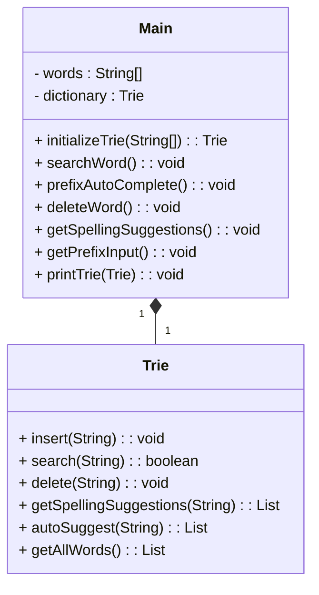

# 基础信息

|      |      |
|------|------|
| 编码语言 | .java |
| 代码路径 | auto-suggest-java/src/main/java/org/example/leansoftx/Main.java |
| 包名 | org.example.leansoftx |
| 依赖项 | ['java.util.List', 'java.util.Scanner'] |
| 概述说明 | 该字典使用前缀树数据结构，实现了搜索、自动补全、删除词和拼写建议等功能，用户可根据提示进行相应的操作，并提供交互输入。 |

# 说明

该项目实现了一个字典，其中包括搜索、自动补全、删除词和拼写建议等功能。字典使用了前缀树数据结构，并初始化了一组单词。用户可以根据提示选择相应的操作，并通过交互输入来进行操作。

# 类列表 Class Summary

| 名称   | 类型  | 说明 |
|-------|------|-------------|
| Main | class | 实现了一个用于搜索、自动补全、删除词和拼写建议的字典。字典使用前缀树数据结构，并初始化了一组单词。可根据提示选择相应的操作，并提供交互输入。 |

## 类 Main

|      |      |
|------|------|
| 访问范围 | public |
| 类型 | class |
| 名称 | Main |
| 说明 | 实现了一个用于搜索、自动补全、删除词和拼写建议的字典。字典使用前缀树数据结构，并初始化了一组单词。可根据提示选择相应的操作，并提供交互输入。 |

### UML类图

类图描述：
这个类图描述了一个单词字典的实现。`Main` 类是程序的入口类，包含了一些操作词典的方法，并使用 `Trie` 类来实现这些操作。`Main` 类的主要方法有 `initializeTrie(String[])` 用于初始化词典，`searchWord()` 进行单词搜索，`prefixAutoComplete()` 进行前缀自动补全，`deleteWord()` 删除单词，`getSpellingSuggestions()` 获取拼写建议，`getPrefixInput()` 获取前缀输入，`printTrie(Trie)` 打印词典的内容。

`Trie` 类是一个前缀树的实现，用于存储和处理单词。它包含了 `insert(String)` 插入单词，`search(String)` 搜索单词，`delete(String)` 删除单词，`getSpellingSuggestions(String)` 获取拼写建议，`autoSuggest(String)` 进行前缀自动补全，`getAllWords()` 获取所有单词等方法。

`Main` 类与 `Trie` 类之间存在关联关系，`Main` 中的 `dictionary` 属性关联了一个 `Trie` 对象，表示 `Main` 类使用 `Trie` 类来实现单词字典的功能。

### 内部方法调用关系图

graph TD
A[initializeTrie] --> B[insert]
B --> A
A --> C[getAllWords]
C --> A
D[main] --> E[printTrieStructure]
E --> D
E --> F[searchWord]
F --> G[printTrie]
G --> F
F --> H[Scanner]
H --> F
H --> I[System.out]
I --> F
F --> J[String.isEmpty]
J --> F
F --> K[System.out]
K --> F
E --> L[prefixAutoComplete]
L --> M[printTrie]
M --> L
L --> N[getPrefixInput]
N --> O[System.out]
O --> N
N --> P[System.in.available()]
P --> N
N --> Q[if..else]
Q --> N
E --> R[deleteWord]
R --> S[printTrie]
S --> R
R --> T[Scanner]
T --> R
T --> U[System.out]
U --> R
R --> V[String.isEmpty]
V --> R
E --> W[getSpellingSuggestions]
W --> X[printTrie]
X --> W
W --> Y[System.out]
Y --> W
W --> Z[String.isEmpty]
Z --> W

该编码是一个 Trie 字典树的实现的 Java 类。Trie 是一种用于快速查找的数据结构。该字典树的初始化和插入功能由 `initializeTrie` 和 `insert` 函数完成。`main` 函数是程序的入口，通过调用 `printTrieStructure`、`searchWord`、`prefixAutoComplete`、`deleteWord` 和 `getSpellingSuggestions` 函数来演示字典树的各种操作。其中 `searchWord` 函数实现从输入中查找单词是否在字典树中，`prefixAutoComplete` 函数实现从输入中查找以某个前缀开头的单词，`deleteWord` 函数实现从字典树中删除指定的单词，`getSpellingSuggestions` 函数实现获取拼写建议。在内部，`main` 函数使用 `Scanner` 读取用户输入，并在必要时调用 `printTrie` 函数打印字典树中的所有单词。

### 字段列表 Field List

| 名称  | 类型  | 说明 |
|-------|-------|------|
| dictionary = initializeTrie(words) | Trie | 定义了一个公共静态变量Trie，通过调用initializeTrie方法初始化，并传入一个words参数。 |
| words = {
            "as", "astronaut", "asteroid", "are", "around",
            "cat", "cars", "cares", "careful", "carefully",
            "for", "follows", "forgot", "from", "front",
            "mellow", "mean", "money", "monday", "monster",
            "place", "plan", "planet", "planets", "plans",
            "the", "their", "they", "there", "towards"
    } | String[] | 这是一个包含30个单词的字符串数组，其中包含了一些与太空、猫、汽车、金钱等相关的词。 |

### 方法列表 Method List

| 名称  | 类型  | 说明 |
|-------|-------|------|
| printTrie | void | 打印Trie字典中的所有单词。 |
| main | void | 调用printTrieStructure方法打印字典的结构。其他几个方法需要注释掉。 |
| initializeTrie | Trie | 根据提供的代码，可以得出以下概要说明：初始化一个trie数据结构，并插入指定的单词。返回初始化后的trie。 |
| getSpellingSuggestions | void | 根据输入的单词获取拼写建议，将建议打印出来。 |
| getPrefixInput | void | 运行此方法时，用户可输入一个前缀进行搜索，按Tab键可循环显示搜索结果，按Enter键可退出搜索。函数实现了用户输入的交互，以及根据前缀搜索结果的显示和处理。 |
| deleteWord | void | 主要功能是删除字典中的单词，实现步骤如下：1. 显示当前字典内容；2. 用户输入要删除的单词或按Enter退出；3. 如果输入为空，退出循环；4. 如果单词在字典中存在，删除并显示删除成功；5. 如果单词不存在，显示未在字典中找到。最后关闭输入流，结束操作。 |
| prefixAutoComplete | void | 概要：该代码段实现了自动补全功能，包括输出前缀树字典以及获取前缀输入。 |
| searchWord | void | 输入单词搜索功能：通过查找字典中的单词，判断是否存在。 |

