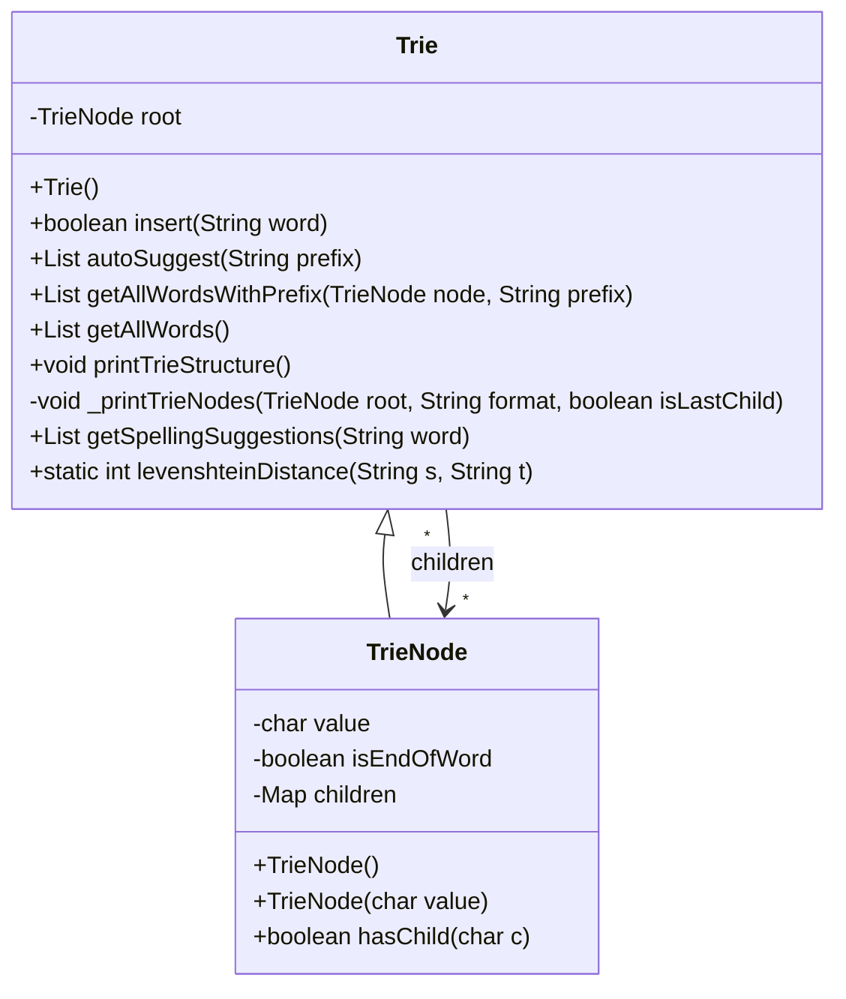

# 基础信息

|      |      |
|------|------|
| 编码语言 | .java |
| 代码路径 | auto-suggest-java/src/main/java/org/example/leansoftx/Trie.java |
| 包名 | org.example.leansoftx |
| 依赖项 | ['java.util'] |
| 概述说明 | 这是一个实现Trie数据结构的程序，包含插入单词、自动补全、获取所有单词、打印Trie结构、拼写建议等功能，可用于字典和拼写检查等应用。 |

# 说明

这个Trie数据结构实现了插入单词、自动补全、获取所有单词、打印Trie结构、拼写建议等功能。插入单词操作将单词按字符拆解，并逐个插入到Trie树中。自动补全操作根据输入的前缀返回以该前缀开头的所有单词。获取所有单词操作返回Trie中存储的所有单词。打印Trie结构操作以树状结构打印出Trie中存储的所有字符。拼写建议操作返回与输入单词相近（编辑距离不超过2）的所有单词。

# 类列表 Class Summary

| 名称   | 类型  | 说明 |
|-------|------|-------------|
| Trie | class | 这是一个Trie数据结构的实现。它包含插入单词、自动补全、获取所有单词、打印Trie结构、拼写建议等功能。其中，插入单词操作将单词拆解为字符并依次插入到Trie树中；自动补全操作根据输入的前缀返回以该前缀开头的所有单词；获取所有单词操作返回Trie中的所有单词；打印Trie结构操作以树状结构打印Trie中存储的所有字符；拼写建议操作返回与输入单词相近（编辑距离不超过2）的所有单词。 |

## 类 Trie

|      |      |
|------|------|
| 访问范围 | public |
| 类型 | class |
| 名称 | Trie |
| 说明 | 这是一个Trie数据结构的实现。它包含插入单词、自动补全、获取所有单词、打印Trie结构、拼写建议等功能。其中，插入单词操作将单词拆解为字符并依次插入到Trie树中；自动补全操作根据输入的前缀返回以该前缀开头的所有单词；获取所有单词操作返回Trie中的所有单词；打印Trie结构操作以树状结构打印Trie中存储的所有字符；拼写建议操作返回与输入单词相近（编辑距离不超过2）的所有单词。 |

### UML类图

类图描述：该类图展示了一个Trie（前缀树）的实现。Trie类具有一个私有的TrieNode类型的根节点root，并且包含了一系列的操作方法，如插入单词、自动补全、获取所有具有特定前缀的单词等。TrieNode类表示Trie中的节点，具有一个字符值、表示该节点是否为单词结尾的标志和一个用于存储子节点的映射表。Trie类与TrieNode类之间存在关联关系，并通过*多个形式将多个子节点连接到TrieNode类。该类图完整且准确地反映了Trie的类结构和类之间的关系。

### 内部方法调用关系图

graph TD;
    trie-->insert
    insert-->hasChild
    hasChild-->put
    hasChild-->TrieNode
    put-->TrieNode
    TrieNode-->char
    TrieNode-->children
    TrieNode-->isEndOfWord
    insert-->isEndOfWord
    insert-->getAllWordsWithPrefix
    getAllWordsWithPrefix-->getAllWords
    getAllWordsWithPrefix-->root
    trie-->autoSuggest
    autoSuggest-->hasChild
    hasChild-->prefix
    hasChild-->ArrayList
    ArrayList-->return
    autoSuggest-->getAllWordsWithPrefix
    getAllWordsWithPrefix-->root
    trie-->printTrieStructure
    printTrieStructure-->System.out.println
    printTrieStructure-->_printTrieNodes
    _printTrieNodes-->children
    children-->Map.Entry.comparingByKey
    _printTrieNodes-->root
    _printTrieNodes-->format
    trie-->getSpellingSuggestions
    getSpellingSuggestions-->word.charAt
    getSpellingSuggestions-->ArrayList
    ArrayList-->getAllWordsWithPrefix
    getAllWordsWithPrefix-->root
    getSpellingSuggestions-->levenshteinDistance
    levenshteinDistance-->return
    levenshteinDistance-->d
    levenshteinDistance-->s.length
    levenshteinDistance-->t.length
    levenshteinDistance-->Math.min

### 字段列表 Field List

| 名称  | 类型  | 说明 |
|-------|-------|------|
| root | TrieNode | 该信息表明有一个私有的TrieNode根节点。 |

### 方法列表 Method List

| 名称  | 类型  | 说明 |
|-------|-------|------|
| getAllWords | List<String> | 获取所有单词的方法是通过调用getAllWordsWithPrefix函数，并传入根节点和空字符串作为前缀。 |
| autoSuggest | List<String> | 根据给定的前缀，自动提示单词列表。使用前缀树结构，遍历前缀字符，如果没有子节点则返回空列表，否则返回具有该前缀的所有单词。 |
| printTrieStructure | void | 打印Trie结构的方法，以"root"为根节点，递归地打印每个节点的子节点及其关系。 |
| getAllWordsWithPrefix | List<String> | 该功能方法通过使用前缀和Trie节点来获取包含指定前缀的所有单词列表。 |
| insert | boolean | 根据提供的代码，创建了一个Trie树数据结构，其中的insert方法用于向树中插入一个单词。如果插入成功，则返回true，如果单词已存在，则返回false。 |
| levenshteinDistance | int | 使用Levenshtein距离算法计算字符串之间的差异。然后返回两个字符串之间的编辑距离。通过对字符串中对应字符的比较，确定字符是否相同。不同的字符增加距离，相同字符保持距离不变。最后返回可能的最小编辑距离。 |
| _printTrieNodes | void | 提供了一个私有方法_printTrieNodes，用于打印Trie树节点。
方法会按照格式打印节点值，并根据节点在当前层的位置，添加前缀字符。
节点的子节点按字符排序后，递归调用_printTrieNodes方法打印。 |
| getSpellingSuggestions | List<String> | getSpellingSuggestions方法根据给定的单词返回拼写建议列表，过程如下：
1. 获取给定单词的首字母。
2. 获取以该首字母为前缀的所有单词。
3. 遍历这些单词，计算与给定单词的编辑距离。若编辑距离不超过2，则将该单词加入建议列表。
4. 返回建议列表。

总结：getSpellingSuggestions方法根据首字母前缀，计算给定单词与所有匹配单词的编辑距离，返回不超过2的拼写建议列表。 |

