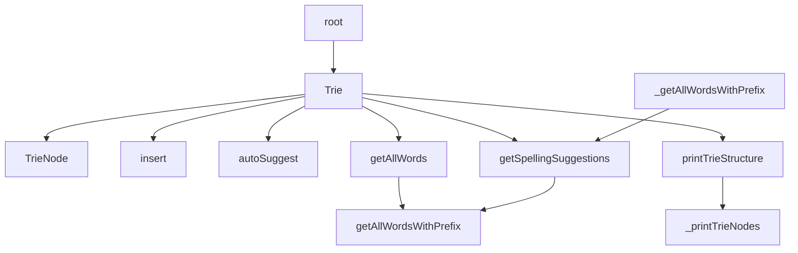

# 基础信息

|      |      |
|------|------|
| 编码语言 | .java |
| 代码路径 | auto-suggest-java/src/main/java/org/example/leansoftx/Trie.java |
| 包名 | org.example.leansoftx |
| 依赖项 | ['java.util'] |
| 概述说明 | Trie类实现前缀树，支持插入、补全、打印树、拼写建议等功能。getAllWordsWithPrefix方法返回指定前缀的所有单词，getSpellingSuggestions返回相似度为2以内的单词。 |

# 说明

Trie类是一个实现了前缀树数据结构的类。它包含了插入单词、自动补全、打印树结构和拼写建议等功能。其中，getAllWordsWithPrefix方法能够返回所有具有指定前缀的单词集合，而getSpellingSuggestions方法能够返回与给定单词在相似度2以内的所有单词建议。通过这些功能，Trie类能够实现对于单词的查找和处理。

# 类列表 Class Summary

| 名称   | 类型  | 说明 |
|-------|------|-------------|
| Trie | class | Trie类实现了前缀树数据结构，能够插入单词、自动补全、打印树结构、给出拼写建议等功能。其中，getAllWordsWithPrefix方法返回具有指定前缀的所有单词，getSpellingSuggestions方法返回与给定单词相似度在2以内的单词。 |

## 类 Trie

|      |      |
|------|------|
| 访问范围 | public |
| 类型 | class |
| 名称 | Trie |
| 说明 | Trie类实现了前缀树数据结构，能够插入单词、自动补全、打印树结构、给出拼写建议等功能。其中，getAllWordsWithPrefix方法返回具有指定前缀的所有单词，getSpellingSuggestions方法返回与给定单词相似度在2以内的单词。 |

### UML类图

classDiagram
class Trie{
  -TrieNode root
  +Trie()
  +insert(String word):boolean
  +autoSuggest(String prefix):List<String>
  +getAllWordsWithPrefix(TrieNode node, String prefix):List<String>
  +getAllWords():List<String>
  +printTrieStructure():void
  -_printTrieNodes(TrieNode root, String format, boolean isLastChild):void
  +getSpellingSuggestions(String word):List<String>
  +levenshteinDistance(String s,String t):int
}
class TrieNode{
  -Map<Character, TrieNode> children
  -char value
  -boolean isEndOfWord
  +TrieNode(char value)
  +hasChild(char c):boolean
}

### 内部方法调用关系图

类 `Trie` 是一个字典树的实现，它有以下几个主要函数（方法）：`insert` 用于插入一个词语到字典树中，`autoSuggest` 用于根据给定的前缀返回所有以该前缀开头的词语，`getAllWords` 用于返回字典树中所有的词语，`printTrieStructure` 用于打印字典树的结构，`getSpellingSuggestions` 用于获取给定词语的拼写建议。内部的 `_printTrieNodes` 函数用于辅助 `printTrieStructure` 打印字典树的每个节点。 `getAllWordsWithPrefix` 是一个辅助函数，同时被 `getAllWords` 和 `getSpellingSuggestions` 调用。

### 字段列表 Field List

| 名称  | 类型  | 说明 |
|-------|-------|------|
| root | TrieNode | TrieNode是私有的根节点。 |

### 方法列表 Method List

| 名称  | 类型  | 说明 |
|-------|-------|------|
| getAllWordsWithPrefix | List<String> | 提供的代码片段是一个方法，该方法的作用是从指定的前缀开始，找到包含该前缀的所有单词。 |
| _printTrieNodes | void | 给定一个Trie树的节点，根据格式打印出该节点及其所有子节点的值，以及树的结构表现形式。 |
| printTrieStructure | void | 打印Trie结构，包含根节点和其子节点。 |
| getAllWords | List<String> | 返回以给定前缀开头的所有单词的列表。 |
| getSpellingSuggestions | List<String> | 根据输入的单词，获取拼写建议列表。首先根据首字母获取所有以此为前缀的单词列表，然后计算与输入单词的编辑距离，若距离不超过2，则添加到建议列表并返回。 |
| autoSuggest | List<String> | 根据提供代码，autoSuggest方法接受一个前缀作为参数，利用Trie树找出所有具有该前缀的单词并返回。TrieNode为节点类，root为根节点。如果找不到该前缀对应的节点，则返回一个空列表。 |
| insert | boolean | 插入函数insert：根据给定的单词，遍历字母依次插入字典树中，如遇到不存在的字母则创建新的节点。最后判断是否已经是一个单词的结尾，如果是则返回false，否则将该节点标记为单词结尾并返回true。 |
| levenshteinDistance | int | 给定两个字符串s和t，计算它们之间的Levenshtein距离。Levenshtein距离定义为将一个字符串转换为另一个字符串所需的最小操作数，其中操作可以是插入、删除或替换一个字符。使用动态规划的方式实现该算法。返回两个字符串的Levenshtein距离。 |

