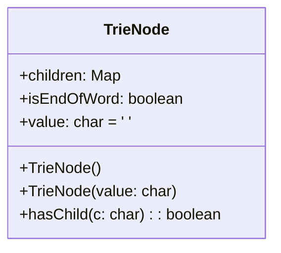

# 基础信息

|      |      |
|------|------|
| 编码语言 | .java |
| 代码路径 | auto-suggest-java/src/main/java/org/example/leansoftx/TrieNode.java |
| 包名 | org.example.leansoftx |
| 依赖项 | ['java.util.HashMap', 'java.util.Map'] |
| 概述说明 | 这是一个Trie树节点的Java类，包含子节点Map和表示结尾的布尔值。可以存储字符值，并提供判断是否存在特定字符子节点的方法。 |

# 说明

TrieNode是一个用于存储Trie树节点的Java类。它包含了一个名为children的Map对象，用于存储当前节点的子节点。另外，该类还拥有一个名为isEndOfWord的布尔属性，用来表示当前节点是否为一个单词的结尾。此外，TrieNode还可以存储一个字符值。

TrieNode类提供了一个名为hasChild的方法，用来判断当前节点是否存在以指定字符为值的子节点。该方法会在children对象中查找是否存在以指定字符为键的映射，若存在则返回true，否则返回false。函数的时间复杂度与Trie树的高度相关。

总之，TrieNode类是一个用于存储Trie树节点的实现，它通过Map对象维护了一个存储子节点的集合，并提供了方法用于判断是否存在指定字符的子节点。通过TrieNode的属性和方法，我们可以方便地构建和查询Trie树的结构。

# 类列表 Class Summary

| 名称   | 类型  | 说明 |
|-------|------|-------------|
| TrieNode | class | 这是一个Trie树节点的Java类。它包含了一个用于存储子节点的Map，以及一个用于表示节点是否为单词结尾的布尔值。节点还可以存储一个字符值。该类还提供了一个方法用于判断是否存在某个字符的子节点。 |


## 类 TrieNode

|      |      |
|------|------|
| 访问范围 | public |
| 类型 | class |
| 名称 | TrieNode |
| 说明 | 这是一个Trie树节点的Java类。它包含了一个用于存储子节点的Map，以及一个用于表示节点是否为单词结尾的布尔值。节点还可以存储一个字符值。该类还提供了一个方法用于判断是否存在某个字符的子节点。 |


### UML类图



该类图描述了一个名为TrieNode的公共类。TrieNode具有以下属性和方法：
- children：类型为Map<Character, TrieNode>的公共属性，用于存储TrieNode的子节点。
- isEndOfWord：类型为boolean的公共属性，用于指示当前节点是否为单词的结尾。
- value：类型为char，默认值为空格的公共属性，用于存储当前节点的值。
- TrieNode()：公共构造函数，初始化TrieNode的实例。该构造函数会初始化children和isEndOfWord属性，并将value设置为默认值。
- TrieNode(value: char)：公共构造函数，初始化具有指定值的TrieNode的实例。该构造函数会初始化children和isEndOfWord属性，并将value设置为指定值。
- hasChild(c: char)：公共方法，用于检查当前节点是否具有值为c的子节点。

该TrieNode类中没有实现任何接口，也没有继承其他类。


### 内部方法调用关系图

```mermaid
graph TD
A[TrieNode] --> B{构造方法}
A[TrieNode] --> C[hasChild]
B --> D[TrieNode()]
B --> E[TrieNode(char value)]
C --> F[boolean]
C --> G[hasChild(char c)]
```

该类`TrieNode`用于实现字典树的结点。它包含两个构造方法，其中`TrieNode()`和`TrieNode(char value)`用于创建新的结点，`hasChild(char c)`方法用于判断当前结点是否有指定字符c的子结点。

### 字段列表 Field List

| 名称  | 类型  | 说明 |
|-------|-------|------|
| value = ' ' | char | char value is a public variable with a default value of blank space. |
| children | Map<Character, TrieNode> | 提供信息：{public Map<Character, TrieNode> children;}

概要说明：提供的信息是一个包含字符和TrieNode节点的映射表。 |
| isEndOfWord | boolean | isEndOfWord是一个公共的布尔型变量，用于判断是否是单词的末尾。 |

### 方法列表 Method List

| 名称  | 类型  | 说明 |
|-------|-------|------|
| hasChild | boolean | 该方法用于检查给定字符是否存在于子节点中。如果给定的字符在子节点的映射中存在，则返回true；否则返回false。 |


