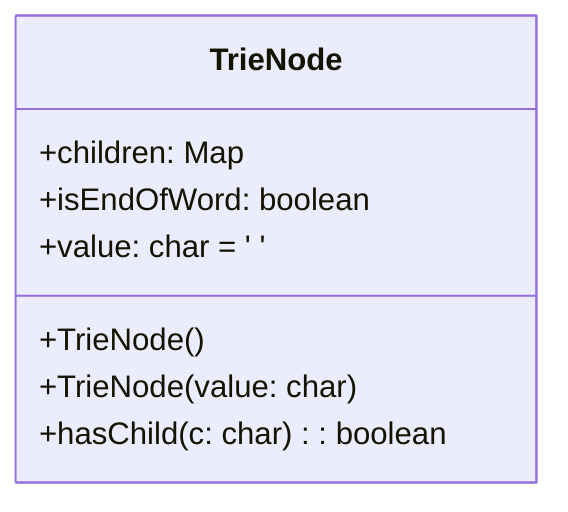

# 基础信息

|      |      |
|------|------|
| 编码语言 | .java |
| 代码路径 | auto-suggest-java/src/main/java/org/example/leansoftx/TrieNode.java |
| 包名 | org.example.leansoftx |
| 依赖项 | ['java.util.HashMap', 'java.util.Map'] |
| 概述说明 | TrieNode类是用于实现字典树的节点类。具有children属性，判断是否存在子节点。还有isEndOfWord属性表示节点是否为单词末尾，value属性用于存储节点值。 |

# 说明

TrieNode类是一个用于实现字典树的节点类。该类具有children属性，用于存储子节点信息，并且可以通过hasChild方法判断是否存在指定子节点。同时，该类还有isEndOfWord属性用于表示当前节点是否为单词的末尾，以及value属性用于存储节点的值。这个类的主要作用是构建和表示字典树的节点结构。字典树是一种用于高效存储和检索字符串的数据结构，在文本搜索和字典应用中具有广泛的应用。通过使用TrieNode类，可以创建一个完整的字典树，并且可以在字典树中插入、查找和删除字符串。例如，通过调用hasChild方法，可以判断某个字符串在字典树中是否存在。isEndOfWord属性则可以用来标记字典树中某个节点是否为一个完整的单词。value属性可以用来存储节点的值，比如在字典应用中，可以将节点的值设置为单词的含义或解释。综上所述，TrieNode类是一个用于实现字典树的重要节点类，它提供了构建字典树所需的基本功能和属性，并支持对字典树进行高效的操作和查询。

# 类列表 Class Summary

| 名称   | 类型  | 说明 |
|-------|------|-------------|
| TrieNode | class | TrieNode类是一个用于实现字典树的节点类。该类具有children属性，用于存储子节点信息，并且可以通过hasChild方法判断是否存在指定子节点。同时，该类还有isEndOfWord属性用于表示当前节点是否为单词的末尾，以及value属性用于存储节点的值。 |

## 类 TrieNode

|      |      |
|------|------|
| 访问范围 | public |
| 类型 | class |
| 名称 | TrieNode |
| 说明 | TrieNode类是一个用于实现字典树的节点类。该类具有children属性，用于存储子节点信息，并且可以通过hasChild方法判断是否存在指定子节点。同时，该类还有isEndOfWord属性用于表示当前节点是否为单词的末尾，以及value属性用于存储节点的值。 |

### UML类图

类图描述：以上是一个TrieNode类的类图。TrieNode类有三个属性：children、isEndOfWord和value，分别表示字符映射、是否为单词结束和字符值。TrieNode类有两个构造方法：一个是无参构造方法，另一个是有一个字符参数的构造方法。TrieNode类还有一个方法hasChild，用于检查是否存在指定字符的子节点。

### 内部方法调用关系图

graph TD
A(TrieNode)
A --> B(TrieNode)
A --> C(TrieNode)

描述：图中展示了TrieNode类的内部函数调用关系。TrieNode类有两个构造函数，一个是无参构造函数，一个是带参数构造函数。每个构造函数中都会初始化children和isEndOfWord属性。hasChild函数用于检查当前节点是否存在给定字符c的子节点。节点A调用了节点B和节点C表示构造函数之间的调用关系。

### 字段列表 Field List

| 名称  | 类型  | 说明 |
|-------|-------|------|
| value = ' ' | char | 变量value的初始值为空字符。 |
| isEndOfWord | boolean | 提供的信息是一个布尔类型的变量isEndOfWord，用于判断是否为单词的结尾。 |
| children | Map<Character, TrieNode> | 这是一个公共映射，映射的键是字符型的数据，值是TrieNode类型的对象。 |

### 方法列表 Method List

| 名称  | 类型  | 说明 |
|-------|-------|------|
| hasChild | boolean | 该段代码是一个公共方法，用于判断一个字符是否存在于子节点中。该方法返回一个布尔值，表示子节点是否包含该字符。 |

