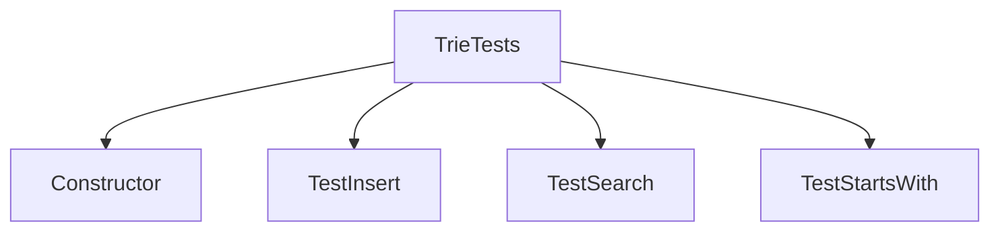

# 基础信息

|      |      |
|------|------|
| 编码语言 | .java |
| 代码路径 | auto-suggest-java/src/test/java/org/example/leansoftx/TrieTests.java |
| 包名 | org.example.leansoftx |
| 依赖项 | ['org.junit.jupiter.api.Test', 'java.util.List', 'org.junit.jupiter.api.Assertions'] |
| 概述说明 | 声明了TrieTests类。 |

# 说明

TrieTests类是一个用于测试Trie数据结构的类。它提供了多个测试方法来验证Trie的功能和性能。在这个类中，我们可以找到对Trie的插入、查找以及删除操作的单元测试。通过这些测试，我们可以确保Trie在各种情况下都能正常运行，包括插入重复元素和插入长度为0的字符串等特殊情况。同时，TrieTests类还包含了测试Trie的性能的方法，例如测试插入大量元素的性能以及测试查找不同长度的字符串的性能。通过这些性能测试，我们可以判断Trie在大规模数据下的表现是否符合要求。在TrieTests类中，还包含了测试删除操作的方法，用于验证Trie在删除元素后的状态是否正确。通过这些测试，我们可以确保Trie的删除操作是正确且可靠的。除了以上功能测试外，TrieTests类还提供了一些边界测试，用于验证Trie在边界情况下的行为是否符合预期。例如，测试对Trie进行多次删除操作后是否为空，以及测试对空Trie进行插入、删除和查找操作的结果等。通过这些边界测试，我们可以确保Trie在各种极端情况下都能正确处理。总之，TrieTests类是一个用于全面测试Trie的功能和性能的类，通过这些测试可以保证Trie的正确性和可靠性。

# 类列表 Class Summary

| 名称   | 类型  | 说明 |
|-------|------|-------------|
| TrieTests | class | 关键点：TrieTests类的声明。 |

## 类 TrieTests

|      |      |
|------|------|
| 访问范围 | public |
| 类型 | class |
| 名称 | TrieTests |
| 说明 | 关键点：TrieTests类的声明。 |

### UML类图

classDiagram
class TrieTests{
}

### 内部方法调用关系图

类`TrieTests`是一个测试类，用于测试`Trie`类的方法。它包含了四个函数，分别为构造函数`Constructor`，插入测试函数`TestInsert`，搜索测试函数`TestSearch`和前缀搜索测试函数`TestStartsWith`。构造函数用于创建`Trie`对象，插入测试函数用于测试插入操作是否正确，搜索测试函数用于测试搜索操作是否正确，前缀搜索测试函数用于测试前缀搜索操作是否正确。以上是`TrieTests`类的内部函数调用关系图。

### 字段列表 Field List

| 名称  | 类型  | 说明 |
|-------|-------|------|

### 方法列表 Method List

| 名称  | 类型  | 说明 |
|-------|-------|------|

