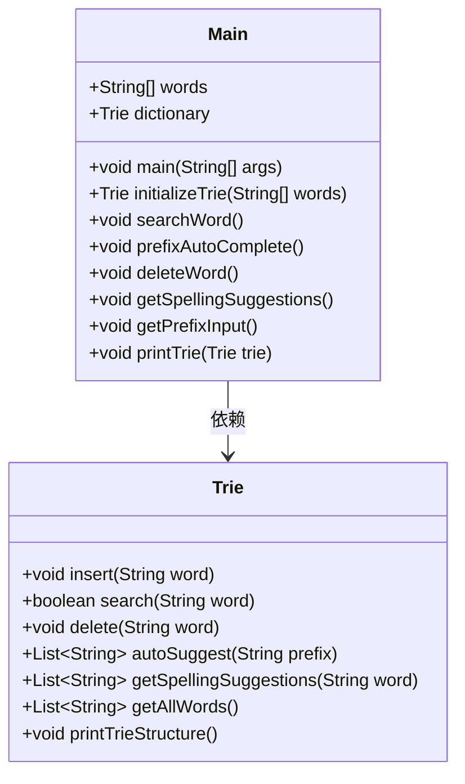
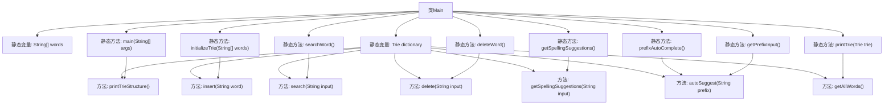

# 基础信息

|      |      |
|------|------|
| 编码语言 | .java |
| 代码路径 | auto-suggest-java/src/main/java/org/example/leansoftx/Main.java |
| 包名 | org.example.leansoftx |
| 依赖项 | ['java.util.List', 'java.util.Scanner'] |
| 概述说明 | Java程序利用Trie结构实现单词存储，支持搜索、补全、删除及拼写建议。 |

# 说明

Java程序采用Trie数据结构来存储单词，该结构支持多种功能，包括单词搜索、自动补全、删除操作以及拼写建议。Trie结构通过树形组织字符，有效提高单词查询和匹配的效率，适用于需要快速检索和补全单词的应用场景。删除功能允许从Trie中移除特定单词，而拼写建议则基于已有单词提供可能的正确拼写选项。

# 类列表 Class Summary

| 名称   | 类型  | 说明 |
|-------|------|-------------|
| Main | class | Java程序使用Trie结构存储单词，支持搜索、自动补全、删除和拼写建议功能。 |

## 类 Main

|      |      |
|------|------|
| 访问范围 | public |
| 类型 | class |
| 名称 | Main |
| 说明 | Java程序使用Trie结构存储单词，支持搜索、自动补全、删除和拼写建议功能。 |

### UML类图

### 描述
这段代码实现了一个基于Trie（前缀树）的字典管理系统。`Main`类负责初始化Trie数据结构，并提供了一系列功能，包括单词搜索、前缀自动补全、单词删除、拼写建议等。`Trie`类实现了Trie数据结构的核心功能，如插入、搜索、删除、自动补全和拼写建议。`Main`类通过调用`Trie`类的方法来管理字典中的单词，并提供了用户交互的接口。

### 内部方法调用关系图

这段代码定义了一个 `Main` 类，包含一个静态的字符串数组 `words` 和一个静态的 `Trie` 对象 `dictionary`。`Main` 类中的 `initializeTrie` 方法用于初始化字典树，`main` 方法调用 `printTrieStructure` 方法打印字典树结构。其他方法如 `searchWord`、`prefixAutoComplete`、`deleteWord` 和 `getSpellingSuggestions` 分别用于搜索单词、前缀自动补全、删除单词和获取拼写建议。`getPrefixInput` 方法处理用户输入并实现前缀自动补全功能，`printTrie` 方法打印字典树中的所有单词。

### 字段列表 Field List

| 名称  | 类型  | 说明 |
|-------|-------|------|
| dictionary = initializeTrie(words) | Trie | 静态字典Trie由words初始化。 |
| words = {
            "as", "astronaut", "asteroid", "are", "around",
            "cat", "cars", "cares", "careful", "carefully",
            "for", "follows", "forgot", "from", "front",
            "mellow", "mean", "money", "monday", "monster",
            "place", "plan", "planet", "planets", "plans",
            "the", "their", "they", "there", "towards"
    } | String[] | 字符串数组包含以a、c、f、m、p、t开头的多个单词。 |

### 方法列表 Method List

| 名称  | 类型  | 说明 |
|-------|-------|------|
| deleteWord | void | 静态方法删除字典中的单词，支持用户输入和退出。 |
| prefixAutoComplete | void | 静态方法prefixAutoComplete打印字典并获取前缀输入。 |
| initializeTrie | Trie | 初始化Trie树，插入给定字符串数组中的单词。 |
| getPrefixInput | void | Java方法实现前缀输入搜索，支持Tab循环结果，Enter退出。 |
| printTrie | void | 打印字典树中所有单词，输出格式为逗号分隔的单词列表。 |
| searchWord | void | 静态方法searchWord用于搜索字典中的单词，支持输入和退出功能。 |
| getSpellingSuggestions | void | 该方法用于获取拼写建议，打印字典并提示输入单词，输出相似词或无建议提示。 |
| main | void | 主方法调用字典结构打印，其他功能注释未启用。 |

