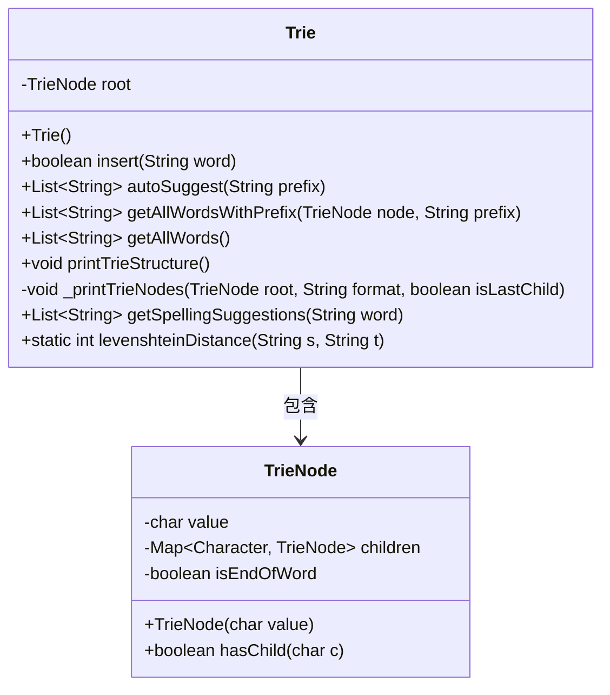
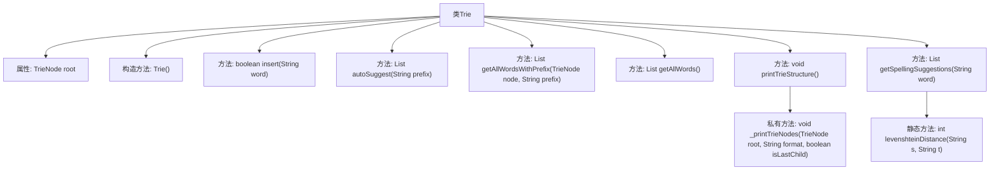

# 基础信息

|      |      |
|------|------|
| 编码语言 | .java |
| 代码路径 | auto-suggest-java/src/main/java/org/example/leansoftx/Trie.java |
| 包名 | org.example.leansoftx |
| 依赖项 | ['java.util'] |
| 概述说明 | Trie类支持插入、自动建议和拼写建议功能。 |

# 说明

Trie类实现了一个高效的数据结构，支持插入操作，能够将单词逐个字符存储于树形结构中。该结构还具备自动建议功能，可根据用户输入的前缀快速检索并返回匹配的单词列表。此外，Trie类还提供了拼写建议功能，能够识别并纠正用户输入的拼写错误，推荐最接近的正确单词。这些功能共同提升了文本处理与搜索的效率和准确性。

# 类列表 Class Summary

| 名称   | 类型  | 说明 |
|-------|------|-------------|
| Trie | class | Trie类实现插入、自动建议、拼写建议等功能。 |

## 类 Trie

|      |      |
|------|------|
| 访问范围 | public |
| 类型 | class |
| 名称 | Trie |
| 说明 | Trie类实现插入、自动建议、拼写建议等功能。 |

### UML类图

类图描述：  
该代码实现了一个Trie（前缀树）数据结构，用于高效存储和检索字符串。`Trie`类包含一个`TrieNode`根节点，提供了插入单词、自动补全、获取所有单词、打印Trie结构、拼写建议等功能。`TrieNode`类表示树的节点，包含字符值、子节点映射和是否为单词结尾的标志。`Trie`类依赖于`TrieNode`类来构建和管理树结构。

### 内部方法调用关系图

这段代码实现了一个Trie（前缀树）数据结构，用于高效地存储和检索字符串。Trie类包含多个方法，如插入单词、自动补全、获取所有单词、打印Trie结构、拼写建议等。代码通过递归和深度优先搜索（DFS）来遍历和操作Trie节点，并使用Levenshtein距离算法来提供拼写建议。

### 字段列表 Field List

| 名称  | 类型  | 说明 |
|-------|-------|------|
| root | TrieNode | 私有根节点变量声明。 |

### 方法列表 Method List

| 名称  | 类型  | 说明 |
|-------|-------|------|
| getAllWordsWithPrefix | List<String> | 方法返回以指定前缀开头的所有单词列表。 |
| levenshteinDistance | int | 计算两个字符串的编辑距离。 |
| autoSuggest | List<String> | 方法根据前缀在字典树中查找匹配的单词列表。 |
| _printTrieNodes | void | 递归打印Trie树节点，格式化输出子节点结构。 |
| printTrieStructure | void | 打印Trie树结构，从根节点开始递归输出。 |
| insert | boolean | Trie树插入方法，遍历字符创建节点，标记单词结束。 |
| getAllWords | List<String> | 该方法返回以根节点开始的所有单词列表。 |
| getSpellingSuggestions | List<String> | 获取与输入单词拼写相近的建议词列表，基于前缀匹配和编辑距离筛选。 |

