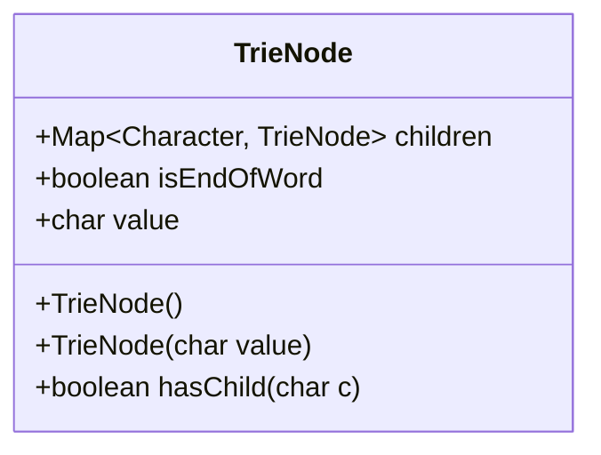
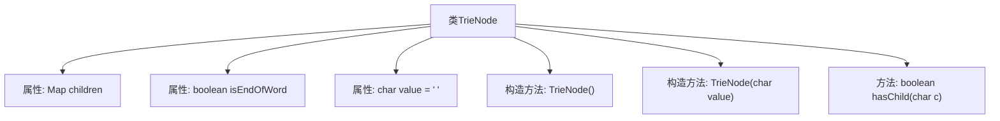

# 基础信息

|      |      |
|------|------|
| 编码语言 | .java |
| 代码路径 | auto-suggest-java/src/main/java/org/example/leansoftx/TrieNode.java |
| 包名 | org.example.leansoftx |
| 依赖项 | ['java.util.HashMap', 'java.util.Map'] |
| 概述说明 | TrieNode类包含字符映射、结束标志和字符值，支持初始化和子节点检查。 |

# 说明

TrieNode类是一个用于实现字典树（Trie）的节点结构。它包含三个主要属性：字符映射，用于存储当前节点到子节点的映射关系；结束标志，用于标记当前节点是否为某个单词的结尾；字符值，用于存储当前节点对应的字符。该类支持初始化操作，允许创建新的节点实例，并提供了检查子节点是否存在的方法，便于在字典树中进行字符的查找和插入操作。

# 类列表 Class Summary

| 名称   | 类型  | 说明 |
|-------|------|-------------|
| TrieNode | class | TrieNode类包含字符映射、结束标志和字符值，支持初始化、检查子节点。 |

## 类 TrieNode

|      |      |
|------|------|
| 访问范围 | public |
| 类型 | class |
| 名称 | TrieNode |
| 说明 | TrieNode类包含字符映射、结束标志和字符值，支持初始化、检查子节点。 |

### UML类图

类图描述：`TrieNode` 类表示字典树中的一个节点，包含一个 `Map` 类型的 `children` 属性，用于存储子节点；`isEndOfWord` 属性标记当前节点是否为单词的结尾；`value` 属性存储当前节点的字符值。类提供了两个构造函数，分别用于初始化空节点和带字符值的节点，以及一个 `hasChild` 方法用于检查是否存在指定字符的子节点。

### 内部方法调用关系图

这段代码定义了一个`TrieNode`类，用于表示字典树（Trie）的节点。该类包含三个属性：`children`用于存储子节点，`isEndOfWord`表示当前节点是否为一个单词的结束，`value`表示当前节点的字符值。类中提供了两个构造方法，分别用于初始化节点的默认值和指定字符值，以及一个`hasChild`方法用于检查当前节点是否包含指定字符的子节点。

### 字段列表 Field List

| 名称  | 类型  | 说明 |
|-------|-------|------|
| children | Map<Character, TrieNode> | 定义了一个映射，键为字符，值为Trie节点。 |
| isEndOfWord | boolean | 该变量表示是否为单词的结尾。 |
| value = ' ' | char | 定义字符变量value并初始化为空格。 |

### 方法列表 Method List

| 名称  | 类型  | 说明 |
|-------|-------|------|
| hasChild | boolean | 检查字符c是否为子节点。 |

