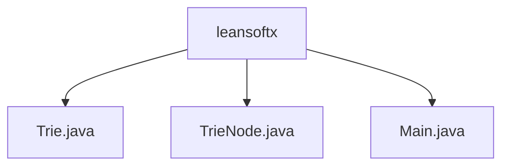

# 基础信息

|      |      |
|------|------|
| 编码语言 | .java |
| 代码路径 | auto-suggest-java/src/main/java/org/example/leansoftx |
| 包名 | auto-suggest-java.src.main.java.org.example.leansoftx |
| 概述说明 | Trie类实现高效数据结构，支持插入、自动建议和拼写纠正功能。TrieNode类包含字符映射、结束标志和字符值，支持查找和插入。Java程序利用Trie进行单词搜索、补全、删除和拼写建议。 |

# 说明

Trie类实现了一个高效的数据结构，支持插入操作，将单词逐个字符存储于树形结构中，具备自动建议和拼写建议功能，提升文本处理与搜索效率。TrieNode类是字典树的节点结构，包含字符映射、结束标志和字符值属性，支持初始化和子节点检查操作。Java程序采用Trie数据结构存储单词，支持单词搜索、自动补全、删除和拼写建议功能，通过树形组织字符提高查询和匹配效率，适用于快速检索和补全单词的场景。

### 包内部结构视图

该流程图展示了 `leansoftx` 目录下的三个文件：`Trie.java`、`TrieNode.java` 和 `Main.java`。这些文件均位于同一层级，表示它们属于同一个模块或项目，且没有进一步的子目录结构。这种层级关系清晰地反映了项目的文件组织方式，便于开发者快速理解文件之间的关联。

# 文件列表 File List

| 名称   | 类型  | 说明 |
|-------|------|-------------|
| [Main.java](Main.md) | file | Java程序利用Trie结构实现单词存储，支持搜索、补全、删除及拼写建议。 |
| [TrieNode.java](TrieNode.md) | file | TrieNode类包含字符映射、结束标志和字符值，支持初始化和子节点检查。 |
| [Trie.java](Trie.md) | file | Trie类支持插入、自动建议和拼写建议功能。 |

